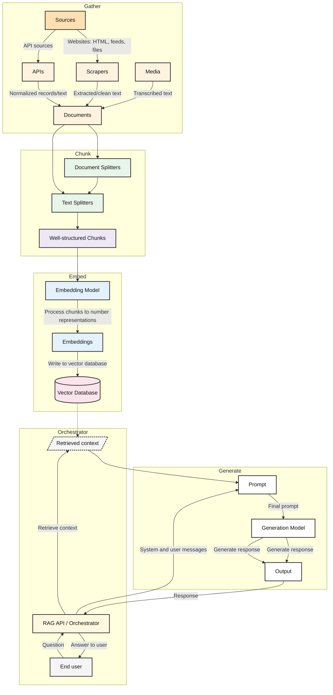

# Proof-of-concept

RAG pipeline in its simplest form consists of following steps:

1. Gather,
2. Chunk,
3. Embed,
4. Vectorize
5. Generate

We also need a way to orchestrate the pipeline and to get user input.

## Tech Stack

Application:
- Symfone
  
Env:
- Docker

Cloud:
- GCP
  
Database:
- ChromaDB(?)
